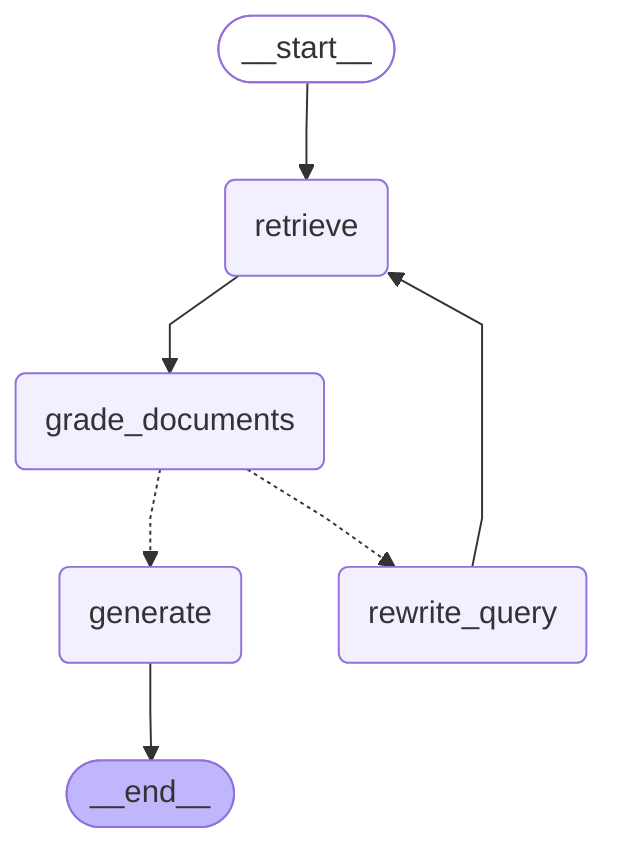
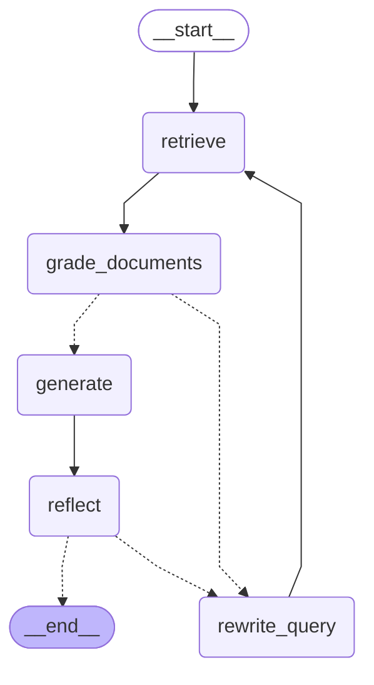
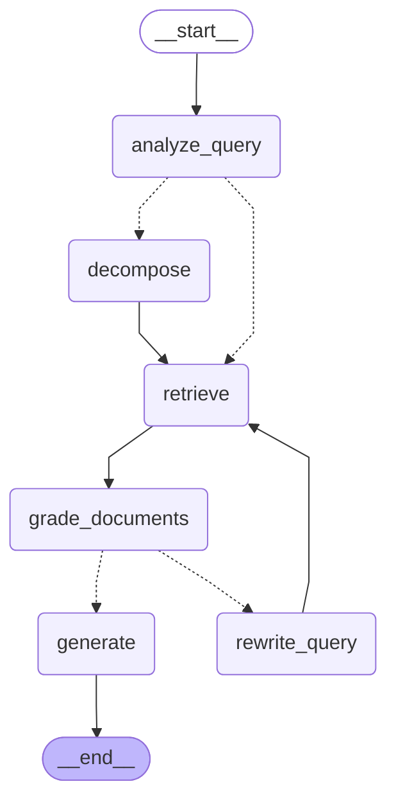

# Week 6 — Agentic RAG Workflow Diagram

LangGraph 기반 `retrieve → grade_documents → rewrite_query → generate` + 조건부 라우팅/retry(≤2).
V1은 generate 뒤 `reflect`(groundedness)를 추가. V2는 진입부에 `analyze_query`(단답/복합 분류) + `decompose`(복합이면 proactive multi-query)를 추가.

## V0 — base (retrieve→grade→rewrite→generate + retry)

## V1 — +reflect

## V2 — adaptive router (analyze_query → decompose → retrieve)

